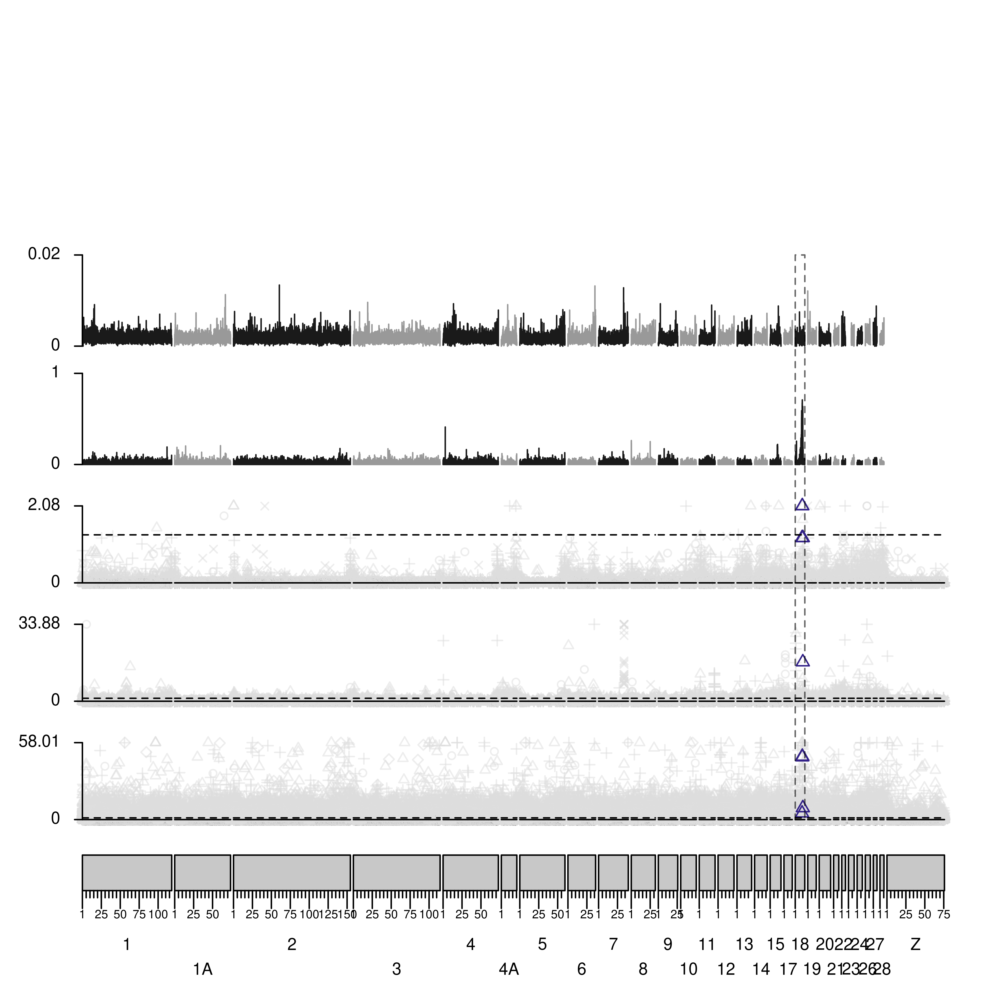
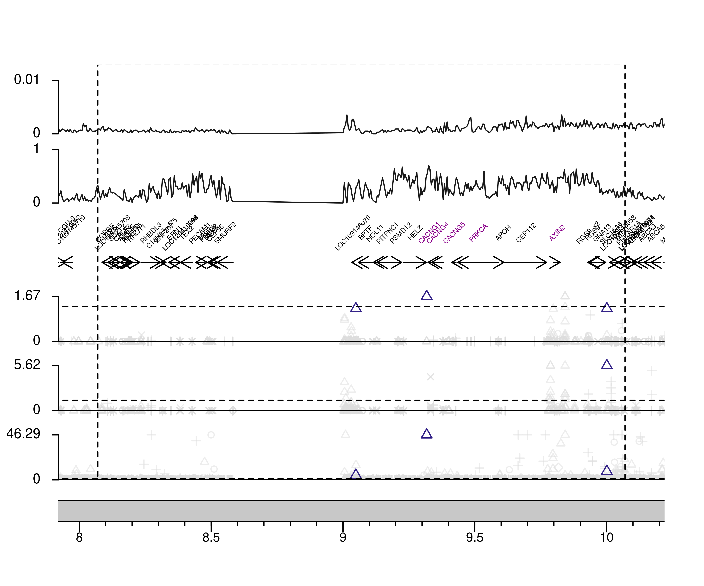
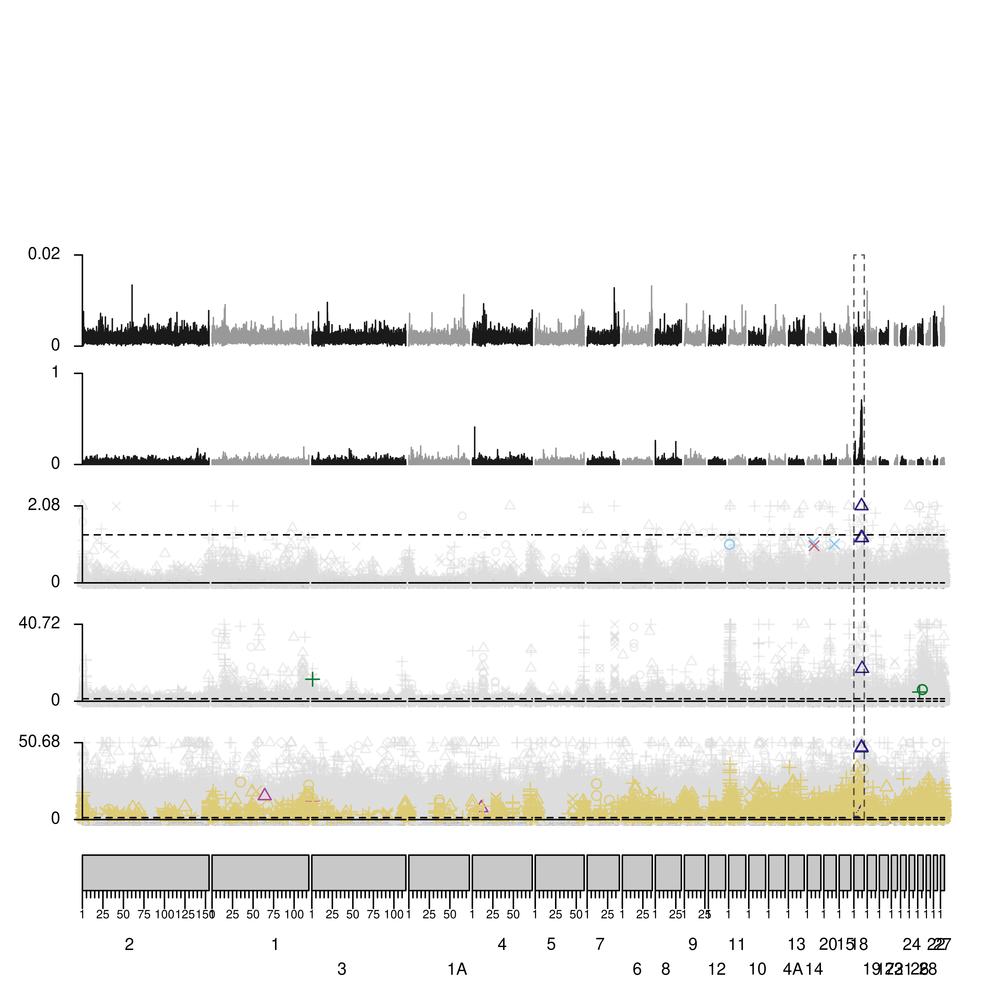

# Methylomic divergence

Many analyses: manhattan plots of taxon and all other variables, linearity between hybrid index and methylation % for the taxon DMPs, bootstrapped differences between focal region taxon differences and genome background. 

Manhattan plot, showing the FDR-corrected pvalues for 5mC and pop gen data:

## Primary Taxon - With Z

```bash
#### Manhattan Plot, chr18 zoom in, and chi squared 
setwd('/dss/dsslegfs01/pr53da/pr53da-dss-0021/projects/2021__Cuckoo_Resequencing/crow_scratch/2021-07_HybridZone/Nov/Classification_Sept')
.libPaths('~/mambaforge/envs/r/lib/R/library')
library(tidyverse)
library(karyoploteR)
library(viridis)
library(LICORS)
library(ggplot2)
library(scales)
library(RColorBrewer)

#set up genome
genome <- read.table('genome5.7.bed',header=FALSE) %>% filter(str_detect(V1,'scaff|MT',negate=T)) %>% arrange(desc(V2))
names(genome) <- c('chr','end'); genome$start <- 1
genome$chr <- gsub('chr','',genome$chr)
#re-order...
genome = genome %>% mutate(chord = gsub('A','',ifelse(chr == 'Z',30,chr))) %>% arrange(as.numeric(chord))
crowG <- makeGRangesFromDataFrame(genome,seqnames.field = 'chr',start.field = 'start',end.field = 'end')
#for chr 18
crow18 <- makeGRangesFromDataFrame(subset(genome,chr=='18'),seqnames.field = 'chr',start.field = 'start',end.field = 'end')

##### Import 5mC data ####
class <- read.table('Full.DSS.BP-10x.Classified-Annotated_23FEB09.txt',header=TRUE)
class <- class %>% mutate_at(grep("Theta|FuLi|Tajima|Dxy|FST|GC",colnames(.)),funs(as.numeric))
class <- subset(class, Region != '.' & Region != 'Missing')

#Split by FDRS, rename, create some extra columns for plotting 
dats = class %>% select(chr,start,Region,Class,contains('fdrs')) %>%  
  dplyr::rename(WGBS.Taxon = fdrs_Species.wgbs, WGBS.Sex = fdrs_Sex.wgbs, WGBS.TissueL = fdrs_TissueL.wgbs, WGBS.TissueM = fdrs_TissueM.wgbs,                
                CG.Taxon = fdrs_Species.cg, CG.Sex = fdrs_Sex.cg, CG.AgeCHK = fdrs_StageCHK.cg, CG.AgeYRL = fdrs_StageYRL.cg,                
                HZ.Distance = fdrs_Distance.hz, HZ.Temperature = fdrs_Temperature.hz, HZ.HybridIndex = fdrs_Chr18_Hybrid_Index.hz) %>%   
  pivot_longer(!c(chr,start,Region,Class),names_to = 'variable', values_to = 'fdrs') %>%   
  na.omit() %>%  
  mutate(site = paste0(chr,'_',start))

#create back-up, and assign color only with 'correct' consensus classifications 
dats2 = dats %>% 
  separate(variable,into=c('experiment','variable')) %>% 
  mutate(chr = gsub('chr','',chr))
#add colors 
cols = brewer.pal(7,name = 'Paired'); show_col(cols)
cols = viridis(7,option='turbo'); show_col(cols)
cols = c('#88CCEE', '#117733', '#332288', '#DDCC77','#CC6677', '#AA4499', '#DDDDDD'); show_col(cols)
dats3 <- dats2 %>% mutate(Color1 = ifelse(grepl('HybridIndex',variable) == TRUE,'#332288',
                                          ifelse(grepl('Distance',variable) == TRUE,'#CC6677',
                                                 ifelse(grepl('Temperature',variable) == TRUE,'#88CCEE',
                                                        ifelse(grepl('Taxon',variable) == TRUE,'#332288',
                                                               ifelse(grepl('Sex',variable) == TRUE,'#AA4499',
                                                                      ifelse(grepl('Age',variable) == TRUE,'#117733',
                                                                             ifelse(grepl('Tissue',variable) == TRUE,'#DDCC77','No'))))))))

#substitute HI for taxon
dats4 = dats3 %>% 
  mutate(variable = gsub('HybridIndex','Taxon',variable),
         Color = as.character(ifelse(str_detect(variable,Class) & fdrs < 0.1,Color1,
                                     ifelse(fdrs < 0.1,'orange','grey80'))),
         Shape = ifelse(Region == 'Promoter',4,
                        ifelse(Region == 'CDS',1,
                               ifelse(Region == 'Intron',3,
                                      ifelse(Region == 'Intergenic',2,
                                             ifelse(Region == 'Repeat',5,8))))))

dats5 = dats4 %>% unique
write.table(dats5,'5mC_10x_Manhattan_Input-AllVariables-24APR30_withZ.txt',quote=F,sep='\t',row.names=F)

dats3 = read.table('5mC_10x_Manhattan_Input-AllVariables-24APR30_withZ.txt',header=T,sep = "\t",comment.char = '')
dats3 = dats3 %>% mutate(experiment = gsub('CG','ComGar.RRBS',experiment),
                         experiment = gsub('WGBS','ComGar.WGBS',experiment),
                         experiment = gsub('HZ','HybZon.RRBS',experiment))

#import gene track
genes = read.table('GCF_000738735.5_ASM73873v5_genomic.genes.bed',header=F)
names(genes) = c('chr','start','end','strand','label')
genes$chr = gsub('chr','',genes$chr)
#correct strand, and also add a midpoint for label
genes = genes %>% mutate(sstart = ifelse(strand == '+',start,end),
                         send = ifelse(strand == '+',end,start),
                         midpoint = (round(((end-start)/2),0)+start))
#rename some of the LOCS that are known
genes = genes %>% mutate(label = gsub('LOC104696000','ABCA9',label),
                         label = gsub('LOC104696005','RGS9',label),
                         label = gsub('LOC104696026','ABCA9_x2',label),
                         label = gsub('LOC120410983','RGS9_x2',label))
melgene = genes %>% filter(str_detect(label,'AXIN2') | str_detect(label,'PRKCA') | str_detect(label,'CACNG'))
othergene = genes %>% filter(!str_detect(label,'AXIN2') & !str_detect(label,'PRKCA') & !str_detect(label,'CACNG'))

##### Import genetic data ####
divs <- read.table('/dss/dsslegfs01/pr53da/pr53da-dss-0021/projects/2021__Cuckoo_Resequencing/crow_scratch/2021-07_HybridZone/Nov/Classification_Sept/GCF_000738735.5_ASM73873v5_genomic.K28Corvus-FullPopGen.5000bp.bed',header=T)
divs <- divs %>% mutate_at(grep("Theta|FuLi|Tajima|Dxy|FST|GC",colnames(.)),funs(as.numeric))
divs$chr <- gsub('chr','',divs$chr)

gb1 = genome[seq(1, nrow(genome), 2), ][[1]]
gb2 = genome[seq(2, nrow(genome), 2), ][[1]]

#subset each raw dataset into specific colors
div_gb1 <- divs %>% filter(chr %in% gb1)
div_gb1$Color <- "grey60"
div_gb2 <- divs %>% filter(chr %in% gb2)
div_gb2$Color <- "grey10"
divs_use <- rbind(div_gb1,div_gb2) %>% arrange(chr,Genstart)
divs_use = divs_use %>% mutate(Shape = ifelse(Region == 'Promoter',4,
                                              ifelse(Region == 'CDS',1,
                                                     ifelse(Region == 'Intron',3,
                                                            ifelse(Region == 'Intergenic',2,
                                                                   ifelse(Region == 'Repeat',5,8))))),
                               HapD = 1-HapD)

##### Plot All Variable manhattan plots ####
subs = c('Chr18','GW')
gens = c('DxyFST')
subs = 'GW'

#for taxon only
tax = dats3 %>% filter(variable == 'Taxon')
for (sub in subs){
  
  cat('Plotting : ',sub,'\n')
  if (sub == 'Chr18') {ht = 5; wd = 6} else {ht = 7; wd = 7}
  png(paste0(sub,'-Manhattan_TaxonZ_2024MAY01.png'),units='in',res=600,height=ht,width=wd,bg='transparent')
  #pdf(paste0(sub,'-Manhattan_TaxonZ_LABELS_2024MAY01.pdf'),height=ht,width=wd)
  
  #Plot Base, add labels.plotter=NULL for no chr names
  pp <- getDefaultPlotParams(plot.type=4)
  if (sub == 'Chr18') { 
    pp$leftmargin <- 0.08
    cs = 8.07e6 - 150000
    ce = 10.07e6 + 150000
    zoom18 = data.frame('18',cs,ce)
    kp <- plotKaryotype(plot.type=4, genome = crow18,plot.params = pp,zoom = zoom18,labels.plotter=NULL)
    #kp <- plotKaryotype(plot.type=4, genome = crow18,plot.params = pp,labels.plotter=NULL) #for entire chr 
    kpAddBaseNumbers(kp,tick.dist = 500000,minor.tick.dist = 100000,cex=0.65)
    tracks = 6
  } else { 
    pp$leftmargin <- 0.08
    kp <- plotKaryotype(plot.type=4, genome = crowG,plot.params = pp,labels.plotter=NULL)
    #for staggered chr names
    evens <- ((1:length(genome$chr))%%2)==0
    chr.names <- kp$chromosomes
    even.names <- chr.names
    even.names[!evens] <- ""
    odd.names <- chr.names
    odd.names[evens] <- ""
    kpAddChromosomeNames(kp, chr.names = odd.names,cex=0.7)
    kpAddChromosomeNames(kp, chr.names = even.names, yoffset = -7,cex=0.7)
    kpAddBaseNumbers(kp,tick.dist = 25000000,cex=0.5)
    tracks = 6
  }
  
  run <- 'tax'
  vars <- c('ComGar.WGBS','ComGar.RRBS','HybZon.RRBS')
  counter <- 0
  
  for (varz in vars) {
    counter <- counter+1
    cat('Current Autotrack: ',counter,' for ',varz,'\n')
    at <- autotrack(current.track = counter, total.tracks = tracks);
    at$r1 <- at$r1-0.05
    #grab data 
    data <- get(run)
    if (sub == 'Chr18') { data <- subset(data,chr=='18' & start > cs-5000 & start < ce+5000) } else {}
    dat = data %>% filter(experiment == varz)
    dat = dat %>% mutate(FDR = -log10(fdrs))
    dt = dat   
    if (sub == 'Chr18') { thresh = 0.999 } else { thresh = 0.99999}
    maxd = quantile(dt$FDR,thresh)
    dt = dt %>% mutate(FDR = LICORS::threshold(FDR,min=0,max=maxd)) %>% dplyr::rename(val = FDR)
    datNS = subset(dt,Color == 'orange' | Color == 'grey80')
    datS = subset(dt,Color != 'grey80' & Color != 'orange')
    
    #add pvalues, first non-significant
    kpPoints(kp, chr = datNS$chr, x=datNS$start, y=datNS$val,
             #col=transparent(as.character(datNS$Color1),amount=0.85),
             col=transparent('#DDDDDD',amount=0.5),
             pch=datNS$Shape,cex=0.7,
             ymin=0,ymax=maxd,r0=at$r0, r1=at$r1);
    #then significant
    kpPoints(kp, chr = datS$chr, x=datS$start, y=datS$val,
             col=as.character(datS$Color),pch=datS$Shape,cex=0.9,
             ymin=0,ymax=maxd,r0=at$r0, r1=at$r1);
    kpAxis(kp, ymin =0, ymax=maxd,cex=0.7,r0=at$r0, r1=at$r1,col="black",numticks = 2);
    kpAbline(kp, h=0,r0=at$r0, r1=at$r1, col="black", lwd=1,lty=1)
    kpAbline(kp, h=-log10(0.05),ymin=0,ymax=maxd,r0=at$r0, r1=at$r1, col="black", lwd=1,lty=2)
  }
  
  if (sub == 'Chr18') {
    #add genes
    counter = counter+1
    at <- autotrack(current.track = counter, total.tracks = tracks);
    kpArrows(kp, chr=genes$chr, x0=genes$sstart, x1=genes$send, y0=0.15, y1=0.15,length=0.1,lwd=1,r0 = at$r0,r1=at$r1)
    kpText(kp, chr=melgene$chr, x=melgene$midpoint, labels = melgene$label, col='darkmagenta',y=0.6,srt=45,cex=.35,r0 = at$r0,r1=at$r1)
    kpText(kp, chr=othergene$chr, x=othergene$midpoint, labels = othergene$label, y=0.6,srt=45,cex=.35,r0 = at$r0,r1=at$r1)
  } else {}
  
  #add genetic data
  if (gens == 'DxyFST') { genvars = c('FST','Dxy') } else { genvars = c('FST','Dxy','FuLiD','TajimaD','HapD') }
  for (var2 in genvars) {
    counter <- counter+1
    cat('Current Autotrack: ',counter,' for ',var2,'\n')
    at <- autotrack(current.track = counter, total.tracks = tracks);
    at$r1 <- at$r1-0.03
    data <- divs_use
    if (sub == 'Chr18') { data <- subset(data,chr=='18' & start > cs-5000 & start < ce+5000) } else {}
    dat <- data %>% select(c(chr,Region,Genstart,Genend,Color,var2,Shape))
    names(dat) = c('chr','Region','start','end','Color','variable','Shape')
    if (var2 == 'Dxy' & sub == 'Chr18') { maxd = 0.01} else if (var2 == 'Dxy' & sub == 'GW') { maxd = 0.02} else if (var2 == 'FST') { maxd = 1} else {maxd = max(dat$variable,na.rm=TRUE)}
    dat = dat %>% arrange(chr,start)
    # #add genetic values
    grey = dat %>% filter(Color == 'grey60')
    black = dat %>% filter(Color == 'grey10')
    kpLines(kp,chr=grey$chr,x=grey$start,y=grey$variable,ymin=min(dat$variable,na.rm=TRUE),
            col='grey10',ymax=maxd,r0=at$r0, r1=at$r1,clipping=TRUE)
    kpLines(kp,chr=black$chr,x=black$start,y=black$variable,ymin=min(dat$variable,na.rm=TRUE),
            col='grey60',ymax=maxd,r0=at$r0, r1=at$r1,clipping=TRUE)
    kpAxis(kp, ymin =min(dat$variable,na.rm=TRUE), ymax=maxd,cex=0.7,r0=at$r0, r1=at$r1,col="black",numticks = 2)
  }
  
  
  #plot chromosome 18 boundary
  if (sub == 'Chr18') {
    kpRect(kp,chr='18',border='black',x0=cs+150000,x1=ce-150000,y0=0,lty=2,y1=1,r0=0,r1=1) 
  } else { 
    kpRect(kp,chr='18',border=transparent('black',amount=0.4),col=NA,x0=0,x1=12661267,y0=0,y1=1,r0=0,r1=at$r1,lty=2) 
  }
  
  dev.off()
  
}

#chr 7 region
dats3 %>% filter( chr == '7' & start > 33600035 & start < 33956161)
```

### Taxon Test-Statistics Karyoplot

Plot test-statistics from DMP analyses and all population genetic information 

```R
#### Manhattan Plot, GW and chr18 test-statistics
setwd('/dss/dsslegfs01/pr53da/pr53da-dss-0021/projects/2021__Cuckoo_Resequencing/crow_scratch/2021-07_HybridZone/Nov/Classification_Sept')
.libPaths('~/miniconda3/envs/r/lib/R/library')
library(tidyverse)
library(karyoploteR)
library(viridis)
library(LICORS)
library(ggplot2)
library(scales)

#set up genome
genome <- read.table('genome5.7.bed',header=FALSE) %>% filter(str_detect(V1,'scaff|MT|Z',negate=T)) %>% arrange(desc(V2))
names(genome) <- c('chr','end'); genome$start <- 1
genome$chr <- gsub('chr','',genome$chr)
crowG <- makeGRangesFromDataFrame(genome,seqnames.field = 'chr',start.field = 'start',end.field = 'end')
#for chr 18
crow18 <- makeGRangesFromDataFrame(subset(genome,chr=='18'),seqnames.field = 'chr',start.field = 'start',end.field = 'end')

##### Import 5mC data ####
class <- read.table('Full.DSS.BP-10x.Classified-Annotated_23FEB09.txt',header=TRUE)
class <- class %>% mutate_at(grep("Theta|FuLi|Tajima|Dxy|FST|GC",colnames(.)),funs(as.numeric))
class <- subset(class, Region != '.' & Region != 'Missing')
c = read.table('CG_DSS-10x.stat',header=TRUE)
w = read.table('WGBS_DSS-5x.stat',header=TRUE)
h = read.table('HZ_DSS-10x.stat',header=TRUE)

#merge data frames
f = left_join(class,c) %>% 
  left_join(.,w) %>% 
  left_join(.,h)

#first for test statistics 
class2 = f %>%
  dplyr::rename(CG.Taxon.Stat = CG_stat,
                WGBS.Taxon.Stat = WGBS_stat,
                HZ.Taxon.Stat = HZ_stat,
                CG.Taxon.FDR = fdrs_Species.cg,
                WGBS.Taxon.FDR = fdrs_Species.wgbs,
                HZ.Taxon.FDR = fdrs_Chr18_Hybrid_Index.hz)

#Split by FDRS, rename, create some extra columns for plotting 
dats = class2 %>% select(chr,start,Region,Class,matches('FDR|Stat',ignore.case = F)) %>%
  pivot_longer(!c(chr,start,Region,Class),names_to = 'variable', values_to = 'value') %>% 
  na.omit() %>%
  mutate(variable = gsub('2','',variable),
         site = paste0(chr,'_',start),
         CheckShape = as.integer(as.factor(Region)))

#add colors 
dats2 <- dats %>% mutate(Color1 = ifelse(grepl('Taxon',variable) == TRUE,'darkorchid2','No'))

#create back-up, and assign color only with 'correct' consensus classifications 
dats3 <- dats2
dats3 <- dats3 %>% 
  separate(variable,into=c('experiment','variable','stat')) %>% 
  mutate(chr = gsub('chr','',chr))
dats4 = dats3 %>% unique %>% 
  pivot_wider(id_cols = c(chr,start,Region,Class,experiment,variable),names_from = 'stat',values_from = 'value')
dats5 = dats4 %>% mutate(Color = ifelse(variable == 'Taxon' & Class == 'Taxon', 'darkorchid2',
                                        ifelse(variable == 'Taxon' & FDR < 0.1,'orange',
                                               'grey80')))
dats5 %>% count(Color)

#ensure the coloring is correct
dt <- dats5 %>% select(variable,Class,Color) %>% unique()
dtb = dats5
write.table(dats5,'5mC_10x_Manhattan_Input-STAT_23FEB09.txt',quote=F,sep='\t',row.names=F)
dats3 = read.table('5mC_10x_Manhattan_Input-STAT_23FEB09.txt',header=T,comment.char = '')
dats3 = dats3 %>% mutate(Shape = ifelse(Region == 'Promoter',4,
                                        ifelse(Region == 'CDS',1,
                                               ifelse(Region == 'Intron',3,
                                                      ifelse(Region == 'Intergenic',2,
                                                             ifelse(Region == 'Repeat',5,8))))),
                         experiment = gsub('CG','ComGar.RRBS',experiment),
                         experiment = gsub('WGBS','ComGar.WGBS',experiment),
                         experiment = gsub('HZ','HybZon.RRBS',experiment))
dats3 = dats3 %>% mutate(Color = ifelse(variable == 'Taxon' & Class == 'Taxon', 'darkorchid2',
                                        ifelse(variable == 'Taxon' & FDR < 0.1,'orange',
                                               'grey80')))

#import gene track
genes = read.table('GCF_000738735.5_ASM73873v5_genomic.genes.bed',header=F)
names(genes) = c('chr','start','end','strand','label')
genes$chr = gsub('chr','',genes$chr)
#correct strand, and also add a midpoint for label
genes = genes %>% mutate(sstart = ifelse(strand == '+',start,end),
                         send = ifelse(strand == '+',end,start),
                         midpoint = (round(((end-start)/2),0)+start))
#rename some of the LOCS that are known
genes = genes %>% mutate(label = gsub('LOC104696000','ABCA9',label),
                         label = gsub('LOC104696005','RGS9',label),
                         label = gsub('LOC104696026','ABCA9_x2',label),
                         label = gsub('LOC120410983','RGS9_x2',label))
melgene = genes %>% filter(str_detect(label,'AXIN2') | str_detect(label,'PRKCA') | str_detect(label,'CACNG'))
othergene = genes %>% filter(!str_detect(label,'AXIN2') & !str_detect(label,'PRKCA') & !str_detect(label,'CACNG'))

##### Import genetic data ####
divs <- read.table('/dss/dsslegfs01/pr53da/pr53da-dss-0021/projects/2021__Cuckoo_Resequencing/crow_scratch/2021-07_HybridZone/Nov/Classification_Sept/GCF_000738735.5_ASM73873v5_genomic.K28Corvus-FullPopGen.5000bp.bed',header=T)
divs <- divs %>% mutate_at(grep("Theta|FuLi|Tajima|Dxy|FST|GC",colnames(.)),funs(as.numeric))
divs$chr <- gsub('chr','',divs$chr)

gb1 = genome[seq(1, nrow(genome), 2), ][[1]]
gb2 = genome[seq(2, nrow(genome), 2), ][[1]]

#subset each raw dataset into specific colors
div_gb1 <- divs %>% filter(chr %in% gb1)
div_gb1$Color <- "grey60"
div_gb2 <- divs %>% filter(chr %in% gb2)
div_gb2$Color <- "grey10"
divs_use <- rbind(div_gb1,div_gb2) %>% arrange(chr,Genstart)
divs_use = divs_use %>% mutate(Shape = ifelse(Region == 'Promoter',4,
                                              ifelse(Region == 'CDS',1,
                                                     ifelse(Region == 'Intron',3,
                                                            ifelse(Region == 'Intergenic',2,
                                                                   ifelse(Region == 'Repeat',5,8))))),
                               HapD = 1-HapD)

#merge also with coverage data, plot fdr by coverage
cov = read.table('Coverage_All_Experiments.txt',header = T)
co = cov %>% pivot_longer(!c(site)) %>% mutate(name = gsub('_Coverage','',name))
names(co) = c('site','experiment','coverage')
dats4 = merge(dats3,co,by=c('site','experiment'))
dats4 = dats4 %>% mutate(experiment = gsub('CG','ComGar.RRBS',experiment),
                         experiment = gsub('WGBS','ComGar.WGBS',experiment),
                         experiment = gsub('HZ','HybZon.RRBS',experiment))
dats4$experiment = factor(dats4$experiment,levels=c('ComGar.WGBS','ComGar.RRBS','HybZon.RRBS'))
png('Coverage_by_TEST.png',res=300,height=6,width=8,units='in')
fd = dats4 %>% ggplot(aes(x=coverage,y=mstat))+
  geom_point(col='black')+facet_grid(experiment~.,scales='free')+theme_classic()+
  ylab('Test-Statistic (Methylation Divergence)')+xlab('Total Coverage')
fd
dev.off()

#volcano plot
difd = dats3 %>% mutate(experiment = gsub('CG','ComGar.RRBS',experiment),
                        experiment = gsub('WGBS','ComGar.WGBS',experiment),
                        experiment = gsub('HZ','HybZon.RRBS',experiment))
png('Volcano_All.png',units='in',height=3,width=7,res=300)
vol = difd %>% 
  ggplot(aes(x=Stat,y=-log10(FDR),col=Color,alpha=Color))+
  geom_point()+
  scale_color_manual(values=c('darkorchid2','orange','grey80'))+
  scale_alpha_manual(values=c(1,1,0.5))+
  facet_wrap(experiment~variable,scales='free')+
  theme_classic()
vol
dev.off()

##### Plot Test Statistics  ####
subs = c('GW')
statz = c('Stat')
gens = c('All')
for (sub in subs){
  for (gens in gen) {
    
    cat('Plotting : ',sub,' ',statz,' ',gen,'\n')
    if (sub == 'Chr18') {ht = 5; wd = 6} else {ht = 7; wd = 10}
    png(paste0(sub,'-Manhattan_2023JAN25_',statz,'_',gens,'.png'),units='in',res=600,height=ht,width=wd,bg='transparent')
    
    #Plot Base, add labels.plotter=NULL for no chr names
    pp <- getDefaultPlotParams(plot.type=4)
    if (sub == 'Chr18') { 
      pp$leftmargin <- 0.28
      cs = 8.07e6 - 150000
      ce = 10.07e6 + 150000
      zoom18 = data.frame('18',cs,ce)
      kp <- plotKaryotype(plot.type=4, genome = crow18,plot.params = pp,zoom = zoom18,labels.plotter=NULL)
      #kp <- plotKaryotype(plot.type=4, genome = crow18,plot.params = pp,labels.plotter=NULL) #for entire chr, simply unhash
      kpAddBaseNumbers(kp,tick.dist = 500000,minor.tick.dist = 100000,cex=0.65)
      if (gens == 'DxyFST') { tracks = 6 } else { tracks = 9}
    } else { 
      pp$leftmargin <- 0.08
      kp <- plotKaryotype(plot.type=4, genome = crowG,plot.params = pp,labels.plotter=NULL)
      #for staggered chr names
      evens <- ((1:length(genome$chr))%%2)==0
      chr.names <- kp$chromosomes
      even.names <- chr.names
      even.names[!evens] <- ""
      odd.names <- chr.names
      odd.names[evens] <- ""
      kpAddChromosomeNames(kp, chr.names = odd.names,cex=0.7)
      kpAddChromosomeNames(kp, chr.names = even.names, yoffset = -7,cex=0.7)
      kpAddBaseNumbers(kp,tick.dist = 25000000,cex=0.5)
      if (gens == 'DxyFST') { tracks = 6 } else { tracks = 9}
    }
    
    run <- 'dats3'
    vars <- c('ComGar.WGBS','ComGar.RRBS','HybZon.RRBS')
    counter <- 0
    
    for (varz in vars) {
      counter <- counter+1
      cat('Current Autotrack: ',counter,' for ',varz,'\n')
      at <- autotrack(current.track = counter, total.tracks = tracks);
      at$r1 <- at$r1-0.05
      data <- get(run)
      if (sub == 'Chr18') { data <- subset(data,chr=='18') } else {}
      dat = data %>% filter(experiment == varz)
      dat = dat %>% mutate(FDR = -log10(FDR))
      
      if (statz == 'FDR') {
        if (sub == 'Chr18') { thresh = 0.9999 } else { thresh = 0.99999}
        maxd = quantile(dat$FDR,thresh)
        dat = dat %>% mutate(FDR = LICORS::threshold(FDR,min=0,max=maxd)) %>% dplyr::rename(val = FDR)
      } else if (varz == 'ComGar.WGBS' & statz == 'Stat') {
        maxd = 20
        dat = dat %>% mutate(Stat = abs(LICORS::threshold(Stat,min=-maxd,max=maxd))) %>% dplyr::rename(val = Stat)
      } else {
        maxd = 10
        dat = dat %>% mutate(Stat = abs(LICORS::threshold(Stat,min=-maxd,max=maxd))) %>% dplyr::rename(val = Stat)
      }
      datNS = subset(dat,Color == 'grey80' | Color == 'orange')
      datS = subset(dat,Color != 'grey80' & Color != 'orange')
      
      #add pvalues, first non-significant
      kpPoints(kp, chr = datNS$chr, x=datNS$start, y=datNS$val,
               col=transparent(as.character(datNS$Color),amount = 0.7),pch=datNS$Shape,cex=0.710,
               ymin=0,ymax=maxd,r0=at$r0, r1=at$r1);
      #then significant
      kpPoints(kp, chr = datS$chr, x=datS$start, y=datS$val,
               col=transparent(as.character(datS$Color),amount = 0),pch=datS$Shape,cex=0.710,
               ymin=0,ymax=maxd,r0=at$r0, r1=at$r1);
      kpAxis(kp, ymin =0, ymax=maxd,cex=0.7,r0=at$r0, r1=at$r1,col="black",numticks = 2);
      #kpAddLabels(kp,cex=0.7,labels = paste0(varz, ' Taxon T-Stat'),r0=at$r0, r1=at$r1,col="black",srt=0,label.margin = 0.04)
      kpAbline(kp, h=0,ymin=0,ymax=maxd,r0=at$r0, r1=at$r1, col="black", lwd=1,lty=2)
      kpAbline(kp, h=0, r0=at$r0, r1=at$r1, col="black", lwd=1,lty=1)
    }
    
    #add genetic data
    if (gens == 'DxyFST') { genvars = c('FST','Dxy') } else { genvars = c('FST','Dxy','FuLiD','TajimaD','HapD') }
    for (var2 in genvars) {
      counter <- counter+1
      cat('Current Autotrack: ',counter,' for ',var2,'\n')
      at <- autotrack(current.track = counter, total.tracks = tracks);
      at$r1 <- at$r1-0.05
      data <- divs_use
      if (sub == 'Chr18') { data <- subset(data,chr=='18') } else {}
      dat <- data %>% select(c(chr,Region,Genstart,Genend,Color,var2,Shape))
      names(dat) = c('chr','Region','start','end','Color','variable','Shape')
      maxd = max(dat$variable,na.rm=TRUE)
      #add genetic values
      dat = dat %>% arrange(chr,start)
      grey = dat %>% filter(Color == 'grey60')
      black = dat %>% filter(Color == 'grey10')
      kpLines(kp,chr=grey$chr,x=grey$start,y=grey$variable,ymin=min(dat$variable,na.rm=TRUE),
              col='grey10',ymax=maxd,r0=at$r0, r1=at$r1,clipping=TRUE)
      kpLines(kp,chr=black$chr,x=black$start,y=black$variable,ymin=min(dat$variable,na.rm=TRUE),
              col='grey60',ymax=maxd,r0=at$r0, r1=at$r1,clipping=TRUE)
      kpAxis(kp, ymin =min(dat$variable,na.rm=TRUE), ymax=maxd,cex=0.7,r0=at$r0, r1=at$r1,col="black",numticks = 2);
      #kpAddLabels(kp,cex=0.7,labels = var2,r0=at$r0, r1=at$r1,col="black",srt=0,label.margin = 0.07)
    }
    
    #plot chromosome 18 boundary
    if (sub == 'Chr18') {} else { kpRect(kp,chr='18',border='black',col=transparent('grey75',amount = 0.7),x0=0,x1=12661267,y0=0,y1=1,r0=0,r1=at$r1) }
    
    dev.off()
    
  }
}

```

## All Variables Karyoplot

Plot FDR-p-values for all variables in 5mC experiments: 

```R
#### Manhattan Plot, chr18 zoom in, and chi squared 
setwd('/dss/dsslegfs01/pr53da/pr53da-dss-0021/projects/2021__Cuckoo_Resequencing/crow_scratch/2021-07_HybridZone/Nov/Classification_Sept')
.libPaths('~/miniconda3/envs/r/lib/R/library')
library(tidyverse)
library(karyoploteR)
library(viridis)
library(LICORS)
library(ggplot2)
library(scales)

#set up genome
genome <- read.table('genome5.7.bed',header=FALSE) %>% filter(str_detect(V1,'scaff|MT|Z',negate=T)) %>% arrange(desc(V2))
names(genome) <- c('chr','end'); genome$start <- 1
genome$chr <- gsub('chr','',genome$chr)
crowG <- makeGRangesFromDataFrame(genome,seqnames.field = 'chr',start.field = 'start',end.field = 'end')
#for chr 18
crow18 <- makeGRangesFromDataFrame(subset(genome,chr=='18'),seqnames.field = 'chr',start.field = 'start',end.field = 'end')

##### Import 5mC data ####
class <- read.table('Full.DSS.BP-10x.Classified-Annotated_23FEB09.txt',header=TRUE)
class <- class %>% mutate_at(grep("Theta|FuLi|Tajima|Dxy|FST|GC",colnames(.)),funs(as.numeric))
class <- subset(class, Region != '.' & Region != 'Missing')

#Split by FDRS, rename, create some extra columns for plotting 
dats = class %>% select(chr,start,Region,Class,contains('fdrs')) %>%  
  dplyr::rename(WGBS.Taxon = fdrs_Species.wgbs, WGBS.Sex = fdrs_Sex.wgbs, WGBS.TissueL = fdrs_TissueL.wgbs, WGBS.TissueM = fdrs_TissueM.wgbs,                
                CG.Taxon = fdrs_Species.cg, CG.Sex = fdrs_Sex.cg, CG.AgeCHK = fdrs_StageCHK.cg, CG.AgeYRL = fdrs_StageYRL.cg,                
                HZ.Distance = fdrs_Distance.hz, HZ.Temperature = fdrs_Temperature.hz, HZ.HybridIndex = fdrs_Chr18_Hybrid_Index.hz) %>%   
  pivot_longer(!c(chr,start,Region,Class),names_to = 'variable', values_to = 'fdrs') %>%   
  na.omit() %>%  
  mutate(site = paste0(chr,'_',start))

#create back-up, and assign color only with 'correct' consensus classifications 
dats2 = dats %>% 
  separate(variable,into=c('experiment','variable')) %>% 
  mutate(chr = gsub('chr','',chr))
#add colors 
cols <- viridis(5)
cols <- cols[c(1,2,4,5)]
dats3 <- dats2 %>% mutate(Color1 = ifelse(grepl('HybridIndex',variable) == TRUE,'darkorchid2',
                                          ifelse(grepl('Distance',variable) == TRUE,'lightpink',
                                                 ifelse(grepl('Temperature',variable) == TRUE,'cadetblue2',
                                                        ifelse(grepl('Taxon',variable) == TRUE,cols[1],
                                                               ifelse(grepl('Sex',variable) == TRUE,cols[2],
                                                                      ifelse(grepl('Age',variable) == TRUE,cols[3],
                                                                             ifelse(grepl('Tissue',variable) == TRUE,cols[4],'No'))))))))

#substitute HI for taxon
dats4 = dats3 %>% 
  mutate(variable = gsub('HybridIndex','Taxon',variable),
         Color = as.character(ifelse(str_detect(variable,Class) & fdrs < 0.1,Color1,
                                     ifelse(fdrs < 0.1,'orange','grey80'))),
         Shape = ifelse(Region == 'Promoter',4,
                        ifelse(Region == 'CDS',1,
                               ifelse(Region == 'Intron',3,
                                      ifelse(Region == 'Intergenic',2,
                                             ifelse(Region == 'Repeat',5,8))))))

dats5 = dats4 %>% unique
write.table(dats5,'5mC_10x_Manhattan_Input-AllVariables-23FEB09.txt',quote=F,sep='\t',row.names=F)

#volcano
v1 = class %>% select(Class,contains(c('divergence'),ignore.case = FALSE))  %>% pivot_longer(!c(Class),values_to = 'Divergence') %>% na.omit %>% mutate(name = gsub('divergence_','',name))
v1 = v1 %>% separate(name,into=c('Variable','Experiment'))
v2 = class %>% select(Class,contains(c('fdrs'),ignore.case = FALSE))  %>% pivot_longer(!c(Class),values_to = 'FDRS') %>% na.omit %>% mutate(name = gsub('fdrs_','',name))
v2 = v2 %>% separate(name,into=c('Variable','Experiment'))
v3 = left_join(v1,v2)
write.table(v3,file='Volcano_Input-23FEB09.txt',quote=F,sep='\t',row.names=F)
v3 = read.table('Volcano_All.png')
dats3 = read.table('5mC_10x_Manhattan_Input-AllVariables-23FEB09.txt',header=T,sep = "\t",comment.char = '')
dats3 = dats3 %>% mutate(experiment = gsub('CG','ComGar.RRBS',experiment),
                         experiment = gsub('WGBS','ComGar.WGBS',experiment),
                         experiment = gsub('HZ','HybZon.RRBS',experiment))

#import gene track
genes = read.table('GCF_000738735.5_ASM73873v5_genomic.genes.bed',header=F)
names(genes) = c('chr','start','end','strand','label')
genes$chr = gsub('chr','',genes$chr)
#correct strand, and also add a midpoint for label
genes = genes %>% mutate(sstart = ifelse(strand == '+',start,end),
                         send = ifelse(strand == '+',end,start),
                         midpoint = (round(((end-start)/2),0)+start))
#rename some of the LOCS that are known
genes = genes %>% mutate(label = gsub('LOC104696000','ABCA9',label),
                         label = gsub('LOC104696005','RGS9',label),
                         label = gsub('LOC104696026','ABCA9_x2',label),
                         label = gsub('LOC120410983','RGS9_x2',label))
melgene = genes %>% filter(str_detect(label,'AXIN2') | str_detect(label,'PRKCA') | str_detect(label,'CACNG'))
othergene = genes %>% filter(!str_detect(label,'AXIN2') & !str_detect(label,'PRKCA') & !str_detect(label,'CACNG'))

##### Import genetic data ####
divs <- read.table('/dss/dsslegfs01/pr53da/pr53da-dss-0021/projects/2021__Cuckoo_Resequencing/crow_scratch/2021-07_HybridZone/Nov/Classification_Sept/GCF_000738735.5_ASM73873v5_genomic.K28Corvus-FullPopGen.5000bp.bed',header=T)
divs <- divs %>% mutate_at(grep("Theta|FuLi|Tajima|Dxy|FST|GC",colnames(.)),funs(as.numeric))
divs$chr <- gsub('chr','',divs$chr)

gb1 = genome[seq(1, nrow(genome), 2), ][[1]]
gb2 = genome[seq(2, nrow(genome), 2), ][[1]]

#subset each raw dataset into specific colors
div_gb1 <- divs %>% filter(chr %in% gb1)
div_gb1$Color <- "grey60"
div_gb2 <- divs %>% filter(chr %in% gb2)
div_gb2$Color <- "grey10"
divs_use <- rbind(div_gb1,div_gb2) %>% arrange(chr,Genstart)
divs_use = divs_use %>% mutate(Shape = ifelse(Region == 'Promoter',4,
                                              ifelse(Region == 'CDS',1,
                                                     ifelse(Region == 'Intron',3,
                                                            ifelse(Region == 'Intergenic',2,
                                                                   ifelse(Region == 'Repeat',5,8))))),
                               HapD = 1-HapD)

#Only plot a single CpG per site, we don't want n=4 sites plotted for ComGarWGBS, only the most significant 
library(data.table)
datsdt = unique(setDT(dats3)[order(fdrs,decreasing = FALSE)], by = c('experiment','site'))


##### Plot All Variable manhattan plots ####
subs = c('GW','Chr18')
gens = c('DxyFST')
for (sub in subs){
  
  cat('Plotting : ',sub,'\n')
  if (sub == 'Chr18') {ht = 5; wd = 6} else {ht = 7; wd = 7}
  png(paste0(sub,'-Manhattan_2023SEPT29.png'),units='in',res=600,height=ht,width=wd,bg='transparent')
  
  #Plot Base, add labels.plotter=NULL for no chr names
  pp <- getDefaultPlotParams(plot.type=4)
  if (sub == 'Chr18') { 
    pp$leftmargin <- 0.08
    cs = 8.07e6 - 150000
    ce = 10.07e6 + 150000
    zoom18 = data.frame('18',cs,ce)
    kp <- plotKaryotype(plot.type=4, genome = crow18,plot.params = pp,zoom = zoom18,labels.plotter=NULL)
    #kp <- plotKaryotype(plot.type=4, genome = crow18,plot.params = pp,labels.plotter=NULL) #for entire chr 
    kpAddBaseNumbers(kp,tick.dist = 500000,minor.tick.dist = 100000,cex=0.65)
    tracks = 6
  } else { 
    pp$leftmargin <- 0.08
    kp <- plotKaryotype(plot.type=4, genome = crowG,plot.params = pp,labels.plotter=NULL)
    #for staggered chr names
    evens <- ((1:length(genome$chr))%%2)==0
    chr.names <- kp$chromosomes
    even.names <- chr.names
    even.names[!evens] <- ""
    odd.names <- chr.names
    odd.names[evens] <- ""
    kpAddChromosomeNames(kp, chr.names = odd.names,cex=0.7)
    kpAddChromosomeNames(kp, chr.names = even.names, yoffset = -7,cex=0.7)
    kpAddBaseNumbers(kp,tick.dist = 25000000,cex=0.5)
    tracks = 6
  }
  
  run <- 'datsdt'
  vars <- c('ComGar.WGBS','ComGar.RRBS','HybZon.RRBS')
  counter <- 0
  
  for (varz in vars) {
    counter <- counter+1
    cat('Current Autotrack: ',counter,' for ',varz,'\n')
    at <- autotrack(current.track = counter, total.tracks = tracks);
    at$r1 <- at$r1-0.03
    #grab data 
    data <- get(run)
    if (sub == 'Chr18') { data <- subset(data,chr=='18' & start > cs-5000 & start < ce+5000) } else {}
    dat = data %>% filter(experiment == varz)
    dat = dat %>% mutate(FDR = -log10(fdrs))
    dt = dat   
    if (sub == 'Chr18') { thresh = 0.9999 } else { thresh = 0.99999}
    maxd = quantile(dt$FDR,thresh)
    dt = dt %>% mutate(FDR = LICORS::threshold(FDR,min=0,max=maxd)) %>% dplyr::rename(val = FDR)
    datNS = subset(dt,Color == 'orange' | Color == 'grey80')
    datS = subset(dt,Color != 'grey80' & Color != 'orange')
    
    #add pvalues, first non-significant
    kpPoints(kp, chr = datNS$chr, x=datNS$start, y=datNS$val,
             #col=transparent(as.character(datNS$Color1),amount=0.85),
             col=transparent('grey60',amount=0.85),
             pch=datNS$Shape,cex=0.7,
             ymin=0,ymax=maxd,r0=at$r0, r1=at$r1);
    #then significant
    kpPoints(kp, chr = datS$chr, x=datS$start, y=datS$val,
             col=as.character(datS$Color),pch=datS$Shape,cex=0.9,
             ymin=0,ymax=maxd,r0=at$r0, r1=at$r1);
    kpAxis(kp, ymin =0, ymax=maxd,cex=0.7,r0=at$r0, r1=at$r1,col="black",numticks = 2);
    kpAbline(kp, h=0,r0=at$r0, r1=at$r1, col="black", lwd=1,lty=1)
  }
  
  if (sub == 'Chr18') {
    #add genes
    counter = counter+1
    at <- autotrack(current.track = counter, total.tracks = tracks);
    kpArrows(kp, chr=genes$chr, x0=genes$sstart, x1=genes$send, y0=0.15, y1=0.15,length=0.1,lwd=1,r0 = at$r0,r1=at$r1)
    kpText(kp, chr=melgene$chr, x=melgene$midpoint, labels = melgene$label, col='darkmagenta',y=0.6,srt=45,cex=.35,r0 = at$r0,r1=at$r1)
    kpText(kp, chr=othergene$chr, x=othergene$midpoint, labels = othergene$label, y=0.6,srt=45,cex=.35,r0 = at$r0,r1=at$r1)
  } else {}
  
  #plot chromosome 18 boundary
  if (sub == 'Chr18') {
    kpRect(kp,chr='18',border='black',x0=cs+150000,x1=ce-150000,y0=0,lty=2,y1=1,r0=0,r1=1) 
  } else { 
    kpRect(kp,chr='18',border=transparent('black',amount=0.4),col=NA,x0=0,x1=12661267,y0=0,y1=1,r0=0,r1=at$r1,lty=2) 
  }
  
  #add genetic data
  if (gens == 'DxyFST') { genvars = c('FST','Dxy') } else { genvars = c('FST','Dxy','FuLiD','TajimaD','HapD') }
  for (var2 in genvars) {
    counter <- counter+1
    cat('Current Autotrack: ',counter,' for ',var2,'\n')
    at <- autotrack(current.track = counter, total.tracks = tracks);
    at$r1 <- at$r1-0.03
    data <- divs_use
    if (sub == 'Chr18') { data <- subset(data,chr=='18' & start > cs-5000 & start < ce+5000) } else {}
    dat <- data %>% select(c(chr,Region,Genstart,Genend,Color,var2,Shape))
    names(dat) = c('chr','Region','start','end','Color','variable','Shape')
    if (var2 == 'Dxy' & sub == 'Chr18') { maxd = 0.01} else if (var2 == 'Dxy' & sub == 'GW') { maxd = 0.02} else if (var2 == 'FST') { maxd = 1} else {maxd = max(dat$variable,na.rm=TRUE)}
    dat = dat %>% arrange(chr,start)
    # #add genetic values
    grey = dat %>% filter(Color == 'grey60')
    black = dat %>% filter(Color == 'grey10')
    kpLines(kp,chr=grey$chr,x=grey$start,y=grey$variable,ymin=min(dat$variable,na.rm=TRUE),
            col='grey10',ymax=maxd,r0=at$r0, r1=at$r1,clipping=TRUE)
    kpLines(kp,chr=black$chr,x=black$start,y=black$variable,ymin=min(dat$variable,na.rm=TRUE),
            col='grey60',ymax=maxd,r0=at$r0, r1=at$r1,clipping=TRUE)
    kpAxis(kp, ymin =min(dat$variable,na.rm=TRUE), ymax=maxd,cex=0.7,r0=at$r0, r1=at$r1,col="black",numticks = 2)
  }
  
  
  
  
  dev.off()
  
}

#### Volcano plot
setwd('/dss/dsslegfs01/pr53da/pr53da-dss-0021/projects/2021__Cuckoo_Resequencing/crow_scratch/2021-07_HybridZone/Nov/Classification_Sept')
.libPaths('~/miniconda3/envs/r/lib/R/library')
library(tidyverse)
library(viridis)
v3 = read.table('Volcano_Input-23FEB09.txt',header=TRUE)
v3 = v3 %>% filter(Experiment != 'hz')
v3 = v3 %>% mutate(Variable = gsub('Species','Taxon',Variable))
v3 = v3 %>% mutate(Experiment = gsub('^cg','ComGar.RRBS',Experiment),
                         Experiment = gsub('^wgbs','ComGar.WGBS',Experiment),
                         Experiment = gsub('^hz','HybZon.RRBS',Experiment))
png('Volcanos_2023FEB14.png',units='in',height=5,width=7,res=600)
vp = v3 %>% ggplot(aes(y=-log10(FDRS),x=Divergence,col=Variable))+
  geom_point()+
  scale_color_viridis(discrete=TRUE,option='turbo')+
  facet_wrap(Variable+Experiment~.,scales='free')+
  theme_bw()
vp
dev.off()
```


## Hybrid Index to 5mC

Calculate linearity of hybrid index for the 4 target sites, as seen Fig. 3.

```R
#### HZ Distributions 
setwd('/dss/dsslegfs01/pr53da/pr53da-dss-0021/projects/2021__Cuckoo_Resequencing/crow_scratch/2021-07_HybridZone/Nov/Classification_Sept')
.libPaths('~/miniconda3/envs/r/lib/R/library')
library(tidyverse)
library(karyoploteR)
library(viridis)
library(LICORS)
library(ggplot2)
library(scales)

##### Import 5mC data ####
class <- read.table('Full.DSS.BP-10x.Classified-Annotated_23FEB09.txt',header=TRUE)
class <- class %>% mutate_at(grep("Theta|FuLi|Tajima|Dxy|FST|GC",colnames(.)),funs(as.numeric))
class <- subset(class, Region != '.' & Region != 'Missing')

#subset only HZ
md = read.table('All-Metadata.txt',header=T)
sites = class %>% filter(Class == 'Taxon') %>% select(site) %>% unique
hz = class %>% select(site,contains('.hz'))
hz = hz[grepl(paste0(sites$site,collapse='|',sep='$'),hz$site),]

#first hybrid index
hi = hz %>% subset(DMP.hz == 'Taxon') %>% 
  select(-c(DMP.hz,Mean5mC.hz,Divergence.hz,Variance.hz,contains('divergence'),contains('fdrs'))) %>%
  pivot_longer(!site,names_to = 'Short_ID',values_to = 'Methylation') %>% 
  mutate(Short_ID = gsub('_BL_CHK_M.hz','',Short_ID))
him = merge(hi,md %>% select(Short_ID,Chr18_Hybrid_Index,Species),by='Short_ID')
him = him %>% mutate(HI = ifelse(Species == 'C.corone','C.c. corone',
                                   ifelse(Species == 'C.cornix','C.c. cornix',
                                          ifelse(Chr18_Hybrid_Index < 0.25,'C.c. corone-like',
                                                 ifelse(Chr18_Hybrid_Index > 0.75,'C.c. cornix-like','Hybrid')))))

him$HI = factor(him$HI,levels=c('C.c. corone','C.c. corone-like','Hybrid','C.c. cornix-like','C.c. cornix'))

hip = him %>% dplyr::rename(Taxon = Species) %>% 
  ggplot(aes(x=Chr18_Hybrid_Index,y=Methylation,fill=HI,shape=HI))+
  geom_jitter(width=0.01,size=3,show.legend = F)+
  scale_fill_grey(start=0,end=1)+
  scale_shape_manual(values=c(24,25,23,22,21))+ylim(c(-.01,1.01))+
  xlab('Genetic Hybrid Index')+ylab('Methylation (%)')+
  facet_wrap(site~.,scales='free')+
  theme_classic()+
  theme(panel.border = element_rect(colour = "black", fill=NA, size=1))
hip

pdf('Hybrid_Index_Linearity-Groups.pdf',height=4,width=4)
hip
dev.off()

```

## LD on Taxon Sites

Plot the sites on chr18 which are identified as genetically related, to see if they are also in LD

```R
setwd('F:/Research/scratch/crow_hybrid_paper/LD/2022_09/')
library(tidyverse)
library(cluster)  
library(factoextra)
library(viridis)
library(genetics)

#import sites and metadata
sites = read.csv('chr18_sites.csv',header=T)
md = read.table('F:/Research/scratch/crow_hybrid_paper/All-Metadata.txt',header=T)
sites = sites %>% dplyr::select(-c(H_Ba_H02,H_Ne_Y03,H_Ne_Y14))

sid=NULL
for (si in unique(sites$site)) {
s1 = subset(sites,site == si) %>% pivot_longer(!(site),names_to='id',values_to = 'mC') %>% dplyr::select(-site) %>% na.omit()
mcd = s1 %>% dplyr::select(mC) %>% data.frame
rownames(mcd) = s1$id

#kmean's clustering
k2 = kmeans(mcd, centers = 3, nstart = 5)
mcd$cluster = k2$cluster
mcd$Short_ID = rownames(mcd)
mcd$site = si

sid = rbind(sid,mcd)
}

#plot
him = merge(sid,md %>% dplyr::select(Short_ID,Chr18_Hybrid_Index,Species),by='Short_ID')
#assign genotypes based on unmeth / het / meth, requires manual specification based on the assigned clusters 
him = him %>% mutate(Genotype = ifelse(site=='chr18_10000910' & cluster == 2, 'U/U',
                                       ifelse(site=='chr18_10000910' & cluster == 1, 'U/M',
                                              ifelse(site=='chr18_10000910' & cluster == 3,'M/M', #first site
                                 ifelse(site=='chr18_9048799' & cluster == 3, 'U/U',
                                        ifelse(site=='chr18_9048799' & cluster == 1, 'U/M',
                                               ifelse(site=='chr18_9048799' & cluster == 2,'M/M', #second site
                                ifelse(site=='chr18_9317485' & cluster == 2, 'U/U',
                                       ifelse(site=='chr18_9317485' & cluster == 1, 'U/M',
                                              ifelse(site=='chr18_9317485' & cluster == 3,'M/M', #third site
                                 ifelse(site=='chr18_9317486' & cluster == 2, 'U/U',
                                        ifelse(site=='chr18_9317486' & cluster == 3, 'U/M',
                                               ifelse(site=='chr18_9317486' & cluster == 1,'M/M', #last site
                                                      'Unassigned')))))))))))))

#plot and confirm genotypes are consistent
hip = him %>% dplyr::rename(Taxon = Species) %>% 
  ggplot(aes(x=Chr18_Hybrid_Index,y=mC,fill=Genotype,shape=Taxon))+
  geom_jitter(width=0.00,size=5,show.legend = T)+
  scale_fill_manual(values=viridis(3,option='mako'))+
  scale_shape_manual(values=c(24,21,22))+ylim(c(-.01,1.01))+
  xlab('Genetic Hybrid Index')+ylab('Methylation (%)')+
  facet_wrap(site~.,scales='free')+
  theme_classic()+
  theme(panel.border = element_rect(colour = "black", fill=NA, size=1))+
  guides(fill=guide_legend(override.aes=list(shape=21)))
hip

pdf('Clustered_Genotypes.pdf',height=5,width=6)
hip
dev.off()

counter = 0
for (si in unique(him$site)) {
  counter = counter + 1
  gts = subset(him,site==si) %>% dplyr::select(Genotype)
  gt = genotype(gts$Genotype)
  assign(paste0('g',counter),gt)
}

LD(g1,g2,g3,g4)

# Pairwise LD
# -----------
#   D        D'      Corr
# Estimates: 0.1854813 0.7419253 0.7419253
# 
#              X^2      P-value  N
# LD Test: 17.6145 2.705178e-05 16
```

# Focal v BG Bootstraps

```R
#Bootstrap distributions 
setwd('/dss/dsslegfs01/pr53da/pr53da-dss-0021/projects/2021__Cuckoo_Resequencing/crow_scratch/2021-07_HybridZone/Nov/Classification_Sept/')
.libPaths('~/miniconda3/envs/r/lib/R/library')
library(tidyverse)
library(viridis)

set.seed(123)
#read file
d2 = read.table('/dss/dsslegfs01/pr53da/pr53da-dss-0021/projects/2021__Cuckoo_Resequencing/crow_scratch/2021-07_HybridZone/Nov/Classification_Sept/5mC_10x_Manhattan_Input-STAT_23FEB09.txt',header=TRUE)
d2 = d2 %>% select(chr,start,Region,experiment,Stat) %>%
  mutate(Focal_Region = ifelse(chr == '18' & start > 8070001 & start < 10070000,'Focal','Undiverged'), #our focal region lies on chr18 between these coordinates
         Stat = abs(Stat)) %>% na.omit %>% filter(Region != 'Repeat') #removing any NAs and we won't analyze repeats because there are so few 

#cycle through these experiments
xps = c('CG','HZ','WGBS')

#store your bootstrapped data in this object 
fullboots = NULL
options(dplyr.summarise.inform = FALSE)
B <- 999 # number of bootstrap replicates, realistically at least 999

bdat=NULL
d3 = d2 %>% mutate(Group = paste0(experiment,'_',Region,'_',Focal_Region)) %>% select(Group,Stat)
groupNa = d2 %>% filter(Focal_Region == 'Focal') %>% count(Focal_Region,experiment,Region)
groupNb = d2 %>% filter(Focal_Region == 'Focal') %>% count(Focal_Region,experiment,Region) %>% mutate(Focal_Region = gsub('Focal','Undiverged',Focal_Region))
groupN = rbind(groupNa,groupNb) %>% mutate(Group = paste0(experiment,'_',Region,'_',Focal_Region)) %>% ungroup %>% select(Group,n) %>% arrange(Group)
d3 %>% 
  group_split(Group) %>% 
  map2_dfr(c(groupN$n), ~ slice_sample(.x, n = .y,replace=TRUE)) %>% 
  group_by(Group) %>% 
  summarize(Mean = mean(Stat,na.rm=TRUE),
            Median = median(Stat,na.rm=TRUE),
            Count = n())
bdat=NULL
## Run the bootstrap procedure:
for (b in 1:B) {
  cat('Iteration: ',b,'\n')
  groupN = rbind(groupNa,groupNb) %>% mutate(Group = paste0(experiment,'_',Region,'_',Focal_Region)) %>% ungroup %>% select(Group,n) %>% arrange(Group)
  d1 = d3 %>% 
    group_split(Group) %>% 
    map2_dfr(c(groupN$n), ~ slice_sample(.x, n = .y,replace=TRUE)) %>% 
    group_by(Group) %>% 
    summarize(Mean = mean(Stat,na.rm=TRUE),
              Count = n())
  bdat = rbind(bdat,d1) #calculate the difference in means between the 2 comparisons 
}

#save 
write.table(bdat,file=paste0('5mC_Bootstraped_ResultsBoxplots-2023FEB13.txt'),quote=F,sep='\t',row.names=F)
bdat = read.table('5mC_Bootstraped_ResultsBoxplots-2023FEB13.txt',header=TRUE)

#fix ugly ass names
bdatplot = bdat %>% separate(Group, into=c('Experiment','Region','Focal_Region')) %>% 
  mutate(Experiment = gsub('CG','ComGar.RRBS',Experiment),
         Experiment = gsub('WGBS','ComGar.WGBS',Experiment),
         Experiment = gsub('HZ','HybZon.RRBS',Experiment)) 
#proper order
bdatplot$Experiment <- factor(bdatplot$Experiment,levels=c('HybZon.RRBS','ComGar.RRBS','ComGar.WGBS'))
bdatplot$Region = factor(bdatplot$Region,levels=c('Promoter','CDS','Intron','Intergenic'))
#calculate CIs
cis = bdatplot %>% 
  group_by(Experiment,Region,Focal_Region,Count) %>% 
  summarize(LowerBound = quantile(Mean,0.025), #can change based on your significance threshold 
            UpperBound = quantile(Mean,0.975))
cis = cis %>% group_by(Experiment,Region) %>% 
  mutate(Signif = ifelse(LowerBound[Focal_Region == 'Focal'] > UpperBound[Focal_Region == 'Undiverged'],'*',
                                     ifelse(UpperBound[Focal_Region == 'Focal'] < LowerBound[Focal_Region == 'Undiverged'],'*','n.s.')))

divplot = bdatplot %>% 
  ggplot(aes(x=Region,y=Mean,fill=Focal_Region))+
  geom_boxplot(alpha=0.8,outlier.alpha = 0.25)+
  geom_text(data=cis,aes(x=Region,group=Region,y=Inf,label=Signif,size=Signif),vjust=1.5,position=position_dodge(width=1))+
  geom_text(data=cis %>% filter(Focal_Region == 'Focal'),aes(x=Region,group=Region,y=-Inf,label=Count),vjust=-1,size=3,position=position_dodge(width=1))+
  scale_size_manual(values=c(6,4))+
  scale_fill_manual(values=c('darkorchid2','grey60'))+
  facet_grid(Experiment~.,scales='free')+
  ylab('Bootstrapped DNA Methylation Divergence') + xlab('')+
  scale_y_continuous(expand = expansion(mult = .25)) + #expand y axis slightly 
  theme_bw()
divplot

pdf('Bootstrapped_MethylationDivergenceBoxplot.pdf',height=5,width=4)
divplot
dev.off()

write.table(cis,file='MethylationDivergence_95CIs.txt',quote=F,sep='\t',row.names=F)

```




* Manhattan plot of taxon effects



* Manhattan plot of chr18 taxon effects



* Manhattan plot of all variables


* Volcano plot of significance against effect size. 


* Association between hybrid index and methylation % for the 4 taxon DMPs. 
