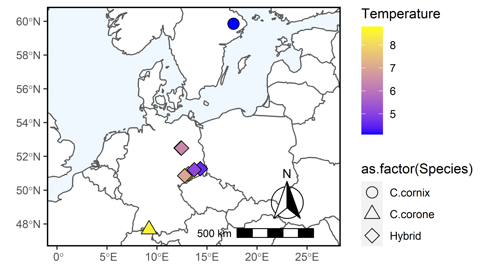
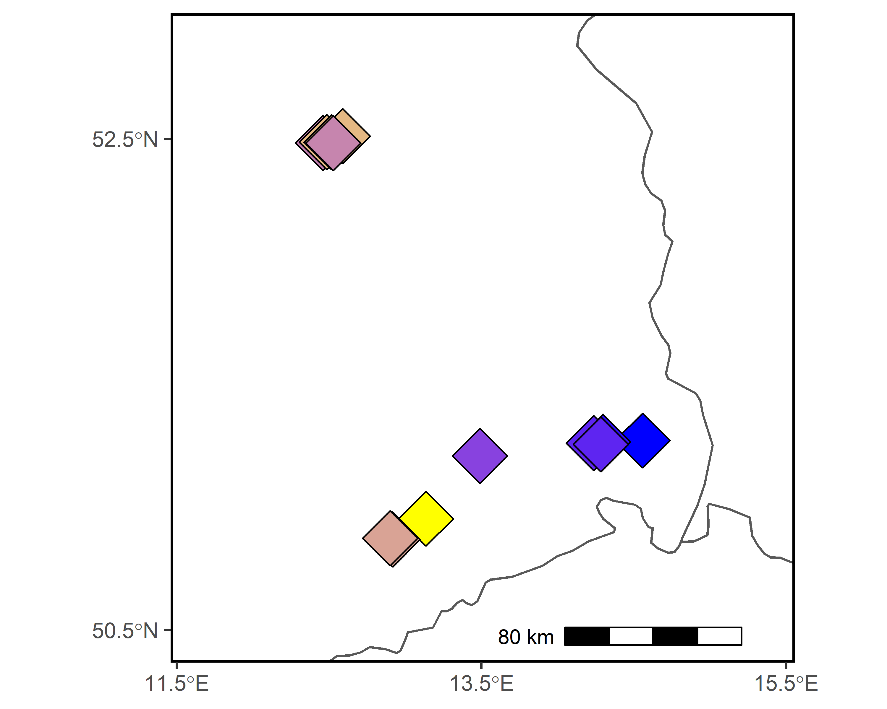

# Spatial Distribution

Plot the distributions of our crows. 

```R
#install.packages(c('cowplot', 'googleway', 'ggplot2', 'ggrepel', 'ggspatial', 'libwgeom', 'sf', 'rnaturalearth', 'rnaturalearthdata'))
setwd('F:/Research/scratch/crow_hybrid_paper')
library(rnaturalearth)
library(rnaturalearthdata)
library(dplyr)
library(sf)
library(ggplot2)
library(viridis)
library(ggspatial)

world <- ne_countries(scale = "medium", returnclass = "sf")
class(world)
ggplot(data = world) +
  geom_sf(color = "black", fill = "palegreen")

cd <- read.table('All-Metadata.txt',header=TRUE)
hz = subset(cd,Retained==1 & Experiment == 'HZ')
sites <- st_as_sf(hz, coords = c("Longitude", "Latitude"), 
                  crs = 4326, agr = "constant")
plum =
  ggplot(data = world) +
  geom_rect(aes(xmin = min(cd$Longitude)-5, xmax = max(cd$Longitude)+5, 
                ymin = min(cd$Latitude)-1, ymax=max(cd$Latitude)+1),fill='lightblue1')+
  geom_sf(fill = "white") +
  geom_sf(data = sites, size = 8, aes(fill = Temperature, shape=as.factor(Species)),col='black') +
  scale_fill_gradient(low='blue',high='yellow')+
  #scale_fill_gradient(low='grey10',high='grey75')+
  scale_shape_manual(values=c(24,21,23))+
  annotation_scale(location = "br", width_hint = 0.3,pad_x = unit(0.3, "in")) +
  annotation_north_arrow(location = "br", which_north = "true", 
                         pad_x = unit(0.3, "in"), pad_y = unit(0.25, "in"),
                         style = north_arrow_fancy_orienteering) +
  coord_sf(xlim = c(min(cd$Longitude)-5, max(cd$Longitude)+5), 
           ylim = c(min(cd$Latitude)-1, max(cd$Latitude)+1), expand = FALSE)+
  theme(panel.border = element_rect(colour = "black", fill=NA, size=1))
plum

png('Crow_Distribution-2022SEPT12.png',units='in',res=600,height=5,width=8,bg='transparent')
plum
dev.off()
```

Hybrid zoom:

```R
#install.packages(c('cowplot', 'googleway', 'ggplot2', 'ggrepel', 'ggspatial', 'libwgeom', 'sf', 'rnaturalearth', 'rnaturalearthdata'))
setwd('F:/Research/scratch/crow_hybrid_paper')
library(rnaturalearth)
library(rnaturalearthdata)
library(dplyr)
library(sf)
library(ggplot2)
library(viridis)
library(ggspatial)

set.seed(123)
world <- ne_countries(scale = "medium", returnclass = "sf")
class(world)
ggplot(data = world) +
  geom_sf(color = "black", fill = "palegreen")

cd <- read.table('All-Metadata.txt',header=TRUE)
hz = subset(cd,Retained==1 & Experiment == 'HZ' & Species == 'Hybrid')
hz = hz %>% mutate(Longitude= jitter(Longitude,25),
                   Latitude= jitter(Latitude,25))
sites <- st_as_sf(hz, coords = c("Longitude", "Latitude"), 
                  crs = 4326, agr = "constant")
plum =
  ggplot(data = world) +
  geom_rect(aes(xmin = min(hz$Longitude)-1, xmax = max(hz$Longitude)+1, 
                ymin = min(hz$Latitude)-1, ymax=max(hz$Latitude)+1),fill='lightblue1')+
  geom_sf(fill = "white") +
  geom_sf(data = sites, size = 8, aes(fill = Temperature, shape=as.factor(Species)),col='black') +
  scale_fill_gradient(low='blue',high='yellow')+
  #scale_fill_gradient(low='grey10',high='grey75')+
  scale_shape_manual(values=c(23))+
  annotation_scale(location = "br", width_hint = 0.3,pad_x = unit(0.3, "in")) +
  annotation_north_arrow(location = "br", which_north = "true", 
                         pad_x = unit(0.3, "in"), pad_y = unit(0.25, "in"),
                         style = north_arrow_fancy_orienteering) +
  coord_sf(xlim = c(min(hz$Longitude)-1, max(hz$Longitude)+1), 
           ylim = c(min(hz$Latitude)-0.5, max(hz$Latitude)+0.5), expand = FALSE)+
  theme(panel.border = element_rect(colour = "black", fill=NA, size=1))+
  scale_x_continuous(breaks = seq(from = 11.5, to = 15.5, by = 2))+
  scale_y_continuous(breaks = seq(from = 50.5, to = 53, by = 2))

plum

png('Crow_Distribution-2023JAN31_HYBRIDS.png',units='in',res=600,height=3,width=4,bg='transparent')
plum
dev.off()

```


All samples




Hybrids only

